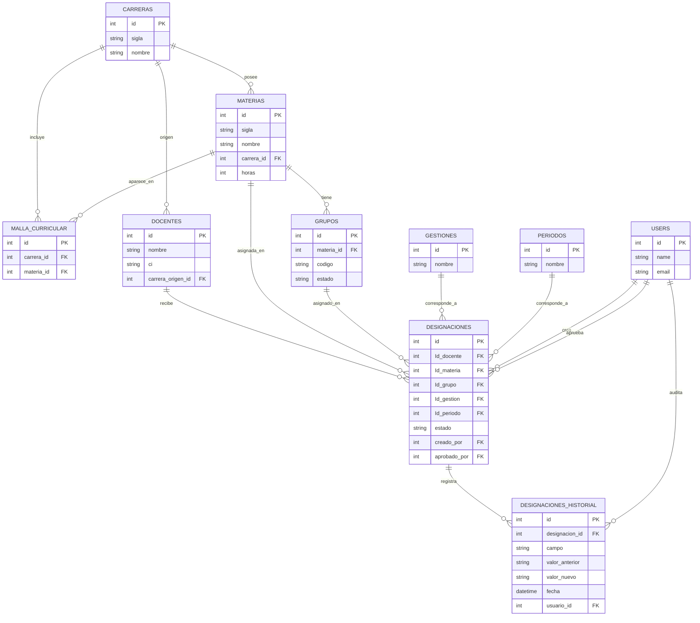

# Modelo de datos — Sistema de Designación de Materias a Docentes (UATF)

## Notas del dominio

- Una materia puede pertenecer a la malla curricular de varias carreras (tabla `malla_curricular`
  como tabla puente entre `carreras` y `materias`).
- `gestiones` y `periodos` son catálogos globales, compartidos por toda la universidad (no
  pertenecen a una carrera específica).
- Los `grupos` pertenecen a una materia y se reutilizan entre periodos; tienen un campo `estado`
  (habilitado/deshabilitado) para deshabilitarlos manualmente sin borrarlos.
- `materias.horas` guarda la carga horaria de la materia (todos sus grupos comparten la misma
  carga). Se usa para la advertencia de 6h y para calcular la carga de un docente
  (`App\Support\CargaAcademicaService`).
- `designaciones` usa nombres de columna con mayúscula inicial (`Id_docente`, `Id_materia`,
  `Id_grupo`, `Id_gestion`, `Id_periodo`) para mantener consistencia con el resto del sistema
  existente de la universidad, no con la convención por defecto de Laravel.
- `estado` y `aprobado_por` en `designaciones` están preparados para un futuro flujo de
  aprobación, todavía no definido por el supervisor. No hay lógica de permisos sobre estos
  campos por ahora.
- `users` existe para auditoría de quién crea/modifica una designación (`creado_por` en
  `designaciones`, `usuario_id` en `designaciones_historial`) y para el login básico del
  sistema. No hay roles ni restricción de acceso por carrera — cualquier usuario logueado
  tiene acceso completo. `aprobado_por` queda sin autocompletar hasta que se defina el flujo
  de aprobación real.
- No hay categoría, dedicación ni especialidad del docente en los datos disponibles.
- `designaciones_historial` registra cambios campo por campo sobre una designación ya creada.
- Borrado: `carreras.materias`, `materias.grupos` y las 5 FK de `designaciones` (`Id_docente`,
  `Id_materia`, `Id_grupo`, `Id_gestion`, `Id_periodo`) bloquean el borrado si tienen hijos
  (`restrictOnDelete`) — los controllers devuelven un error legible en vez de un 500 crudo.
  `designaciones_historial.designacion_id` y `malla_curricular.*` siguen en cascada;
  `docentes.carrera_origen_id` queda en `nullOnDelete`.
