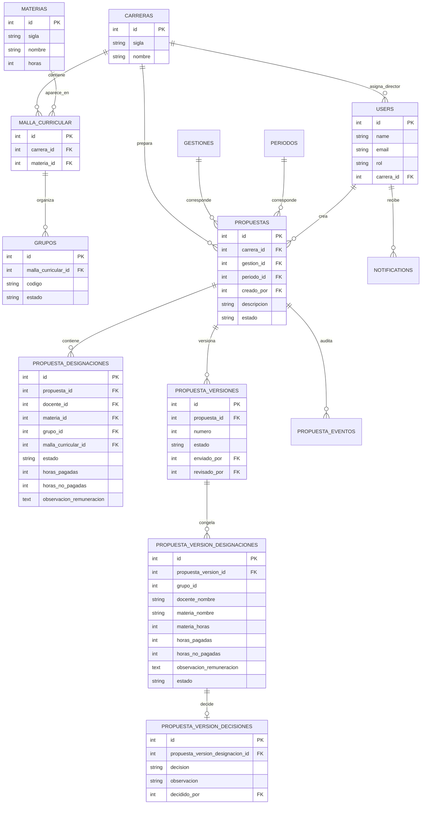

# Modelo de datos


```mermaid
erDiagram
  CARRERAS ||--o{ MALLA_CURRICULAR : contiene
  MATERIAS ||--o{ MALLA_CURRICULAR : aparece_en
  MALLA_CURRICULAR ||--o{ GRUPOS : organiza
  CARRERAS ||--o{ USERS : asigna_director
  CARRERAS ||--o{ PROPUESTAS : prepara
  GESTIONES ||--o{ PROPUESTAS : corresponde
  PERIODOS ||--o{ PROPUESTAS : corresponde
  USERS ||--o{ PROPUESTAS : crea
  PROPUESTAS ||--o{ PROPUESTA_DESIGNACIONES : contiene
  PROPUESTAS ||--o{ PROPUESTA_VERSIONES : versiona
  PROPUESTAS ||--o{ PROPUESTA_EVENTOS : audita
  PROPUESTA_VERSIONES ||--o{ PROPUESTA_VERSION_DESIGNACIONES : congela
  PROPUESTA_VERSION_DESIGNACIONES ||--o| PROPUESTA_VERSION_DECISIONES : decide
  USERS ||--o{ NOTIFICATIONS : recibe

  CARRERAS {
    int id PK
    string sigla
    string nombre
  }
  MATERIAS {
    int id PK
    string sigla
    string nombre
    int horas
  }
  MALLA_CURRICULAR {
    int id PK
    int carrera_id FK
    int materia_id FK
  }
  GRUPOS {
    int id PK
    int malla_curricular_id FK
    string codigo
    string estado
  }
  USERS {
    int id PK
    string name
    string email
    string rol
    int carrera_id FK
  }
  PROPUESTAS {
    int id PK
    int carrera_id FK
    int gestion_id FK
    int periodo_id FK
    int creado_por FK
    string descripcion
    string estado
  }
  PROPUESTA_DESIGNACIONES {
    int id PK
    int propuesta_id FK
    int docente_id FK
    int materia_id FK
    int grupo_id FK
    int malla_curricular_id FK
    string estado
    int horas_pagadas
    int horas_no_pagadas
    text observacion_remuneracion
  }
  PROPUESTA_VERSIONES {
    int id PK
    int propuesta_id FK
    int numero
    string estado
    int enviado_por FK
    int revisado_por FK
  }
  PROPUESTA_VERSION_DESIGNACIONES {
    int id PK
    int propuesta_version_id FK
    int grupo_id
    string docente_nombre
    string materia_nombre
    int materia_horas
    int horas_pagadas
    int horas_no_pagadas
    text observacion_remuneracion
    string estado
  }
  PROPUESTA_VERSION_DECISIONES {
    int id PK
    int propuesta_version_designacion_id FK
    string decision
    string observacion
    int decidido_por FK
  }
```

## Reglas importantes

- Una propuesta es unica para una combinacion de carrera, gestion y periodo.
- El borrador editable vive en `propuesta_designaciones`; cada envio copia sus valores a `propuesta_version_designaciones`.
- PostgreSQL impide actualizar o borrar snapshots y decisiones ya registrados.
- Las decisiones pueden ser por fila o para toda la revision; el historial de eventos se conserva en `propuesta_eventos`.
- Las notificaciones se almacenan en `notifications` y su URL lleva a la ruta canonica.
- `designaciones`, `designaciones_historial` y `revisiones` son datos heredados. No participan en el flujo operativo; `designaciones` puede servir como origen de importaciones historicas.

## Campos requeridos por el flujo de remuneracion del boceto

El boceto define una distribucion por materia/grupo entre horas pagadas y no
pagadas. La implementacion persistente agrega estos campos a
`PROPUESTA_DESIGNACIONES` y a `PROPUESTA_VERSION_DESIGNACIONES`:

```text
horas_pagadas integer not null
horas_no_pagadas integer not null
observacion_remuneracion text nullable
```

Reglas de validacion:

```text
horas_pagadas >= 0
horas_no_pagadas >= 0
horas_pagadas <= MATERIAS.horas
horas_pagadas + horas_no_pagadas >= MATERIAS.horas
```

No existe un limite maximo de horas totales ni de horas adicionales no
pagadas. La carga docente se calcula y se muestra como informacion para la
decision, pero no debe bloquear automaticamente el guardado, envio, revision
ni aprobacion de una propuesta.

Las horas adicionales no pagadas se calculan, no se almacenan como una
segunda designacion:

```text
max(0, horas_pagadas + horas_no_pagadas - MATERIAS.horas)
```

Los snapshots deben conservar exactamente `horas_pagadas`,
`horas_no_pagadas` y `observacion_remuneracion` para que una version enviada
o aprobada no dependa de cambios posteriores del borrador. La migracion realiza
backfill seguro de horas oficiales pagadas, cero horas no pagadas y observacion
nula. Las designaciones heredadas no reciben estos campos.

## Equivalencia de estados entre boceto y backend

El flujo de remuneracion usa el siguiente vocabulario unico. La correspondencia
actual es:

| Boceto | Backend actual | Significado |
|---|---|---|
| `borrador` | `borrador` | Propuesta editable |
| `pendiente` | `pendiente` | Version enviada a revision |
| `observada` | `observada` | Version devuelta para correccion |
| `aprobada` | `oficial` en `propuestas` y `aprobada` en `propuesta_versiones` | Propuesta cerrada |
| `aprobada_previamente` | `oficial` en filas del borrador | Fila congelada por una decision previa |

La implementacion real debe conservar una unica semantica, aunque los nombres
de columnas puedan mantenerse por compatibilidad. La tabla de equivalencia
debe reflejarse tambien en modelos, servicios, politicas, vistas y pruebas.
