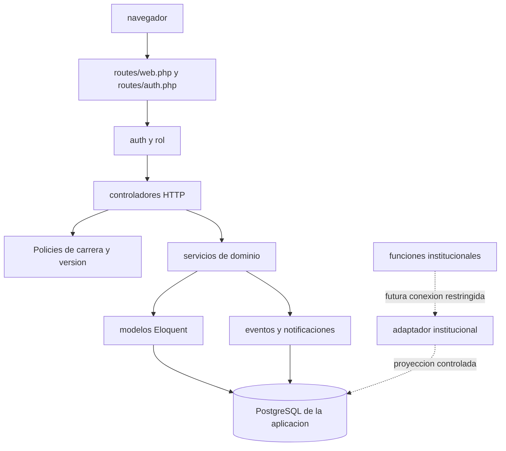
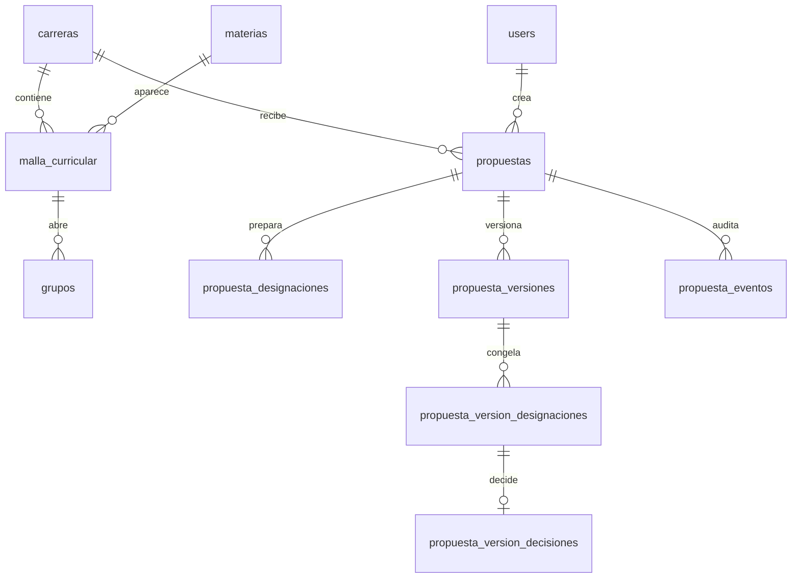
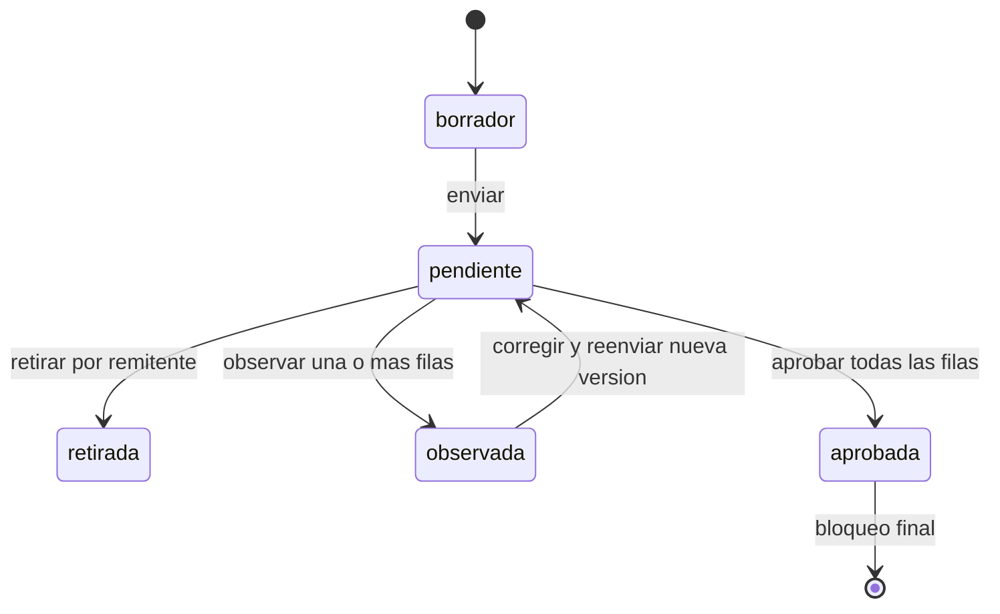

# Guia de aprendizaje de Designaciones UATF

Esta guia esta escrita para que puedas entender, ejecutar, probar y mantener
el sistema sin depender de una herramienta de IA. Usa el codigo actual como
fuente de verdad. Si un documento antiguo contradice al codigo y a las pruebas,
se debe registrar la diferencia antes de cambiar una regla.

## 1. Mapa mental del sistema



La aplicacion no tiene actualmente un adaptador institucional. La base propia
de la aplicacion es el limite de persistencia del flujo actual.

## 2. Donde vive cada responsabilidad

| Responsabilidad | Ubicacion principal | Que debes buscar |
| --- | --- | --- |
| URLs y verbos HTTP | `routes/web.php`, `routes/auth.php` | URI, middleware y nombre de ruta |
| Login y logout | `app/Http/Controllers/Auth/AuthenticatedSessionController.php` | Validacion, autenticacion y regeneracion de sesion |
| Propuestas del Director | `app/Http/Controllers/PropuestaController.php` | Entrada HTTP, autorizacion y respuestas |
| Revision de Vicerrectorado | `app/Http/Controllers/RevisionPropuestaController.php` | Bandeja, revision y decision |
| Persistencia del flujo | `app/Services/PropuestaService.php` | Guardado, envio, snapshot y retiro |
| Importacion | `app/Services/ImportacionPropuestaService.php` | Previsualizacion, precedencia y copia |
| Revision de versiones | `app/Services/RevisionPropuestaService.php` | Decisiones, observaciones y bloqueo |
| Seguridad por carrera | `app/Policies/PropuestaPolicy.php`, `CarreraPolicy.php` | Quien puede ver, editar y enviar |
| Seguridad por version | `app/Policies/PropuestaVersionPolicy.php` | Quien puede revisar o retirar |
| Rol HTTP | `app/Http/Middleware/EnsureRole.php` | `director_carrera` y `vicerrectorado` |
| Reglas estructurales | `database/migrations/` | Foreign keys, checks, indices y triggers |
| Interfaz | `resources/views/` | Blade, Alpine y Tailwind por CDN |
| Evidencia | `tests/Feature/` | Comportamiento observable y regresiones |

Regla práctica: el controlador coordina; el servicio decide reglas de negocio;
el modelo describe datos y relaciones; la vista presenta datos y formulario.
No pongas una regla de negocio nueva solo en JavaScript o Blade.

## 3. Rutas actuales

### Director de Carrera

| Metodo | Ruta | Funcion |
| --- | --- | --- |
| GET | `/designaciones` | Lista propuestas visibles para la carrera |
| POST | `/designaciones` | Crea un borrador |
| POST | `/designaciones/copiar` | Copia una propuesta |
| GET | `/designaciones/{propuesta}` | Abre el editor |
| GET/POST | `/designaciones/{propuesta}/importar` | Previsualiza y aplica importacion |
| PUT | `/designaciones/{propuesta}/asignaciones` | Guarda asignaciones y distribucion |
| POST | `/designaciones/{propuesta}/enviar` | Crea una version pendiente |
| POST | `/designacion-versiones/{version}/retirar` | Retira una version pendiente |

### Vicerrectorado

| Metodo | Ruta | Funcion |
| --- | --- | --- |
| GET | `/revisiones/pendientes` | Bandeja con filtros y busqueda |
| GET | `/revisiones/{version}/revisar` | Snapshot de una version |
| POST | `/revisiones/{version}/decidir` | Aprueba u observa filas |

### Notificaciones

| Metodo | Ruta | Funcion |
| --- | --- | --- |
| GET | `/notificaciones` | Lista notificaciones del usuario |
| POST | `/notificaciones/leer-todas` | Marca todas como leidas |
| POST | `/notificaciones/{notificacion}/leer` | Marca una como leida |

Todas estas rutas, salvo login, estan bajo `auth`. Las rutas del Director usan
`rol:director_carrera`; las de Vicerrectorado usan `rol:vicerrectorado`.

## 4. Recorrido completo de una propuesta

### 4.1 Inicio de sesion

1. El navegador envia credenciales a `routes/auth.php`.
2. `AuthenticatedSessionController` valida y autentica.
3. Laravel crea la sesion.
4. La ruta `/` redirige según el rol.

### 4.2 Creacion y edicion

1. El Director crea un borrador para la gestion actual.
2. `PropuestaController` valida la entrada y autoriza la carrera.
3. `PropuestaService::crearBorrador` guarda la propuesta.
4. El editor muestra grupos habilitados y docentes.
5. El formulario envia cambios a `PUT /asignaciones`.
6. `PropuestaService::guardarCambios` usa transaccion y bloqueo de fila.
7. Se validan carrera, materia, docente, horas y filas aprobadas previamente.

La distribucion de cada fila es:

```text
horas_pagadas
horas_no_pagadas
observacion_remuneracion
```

Las horas deben ser enteras, no negativas, las pagadas no pueden superar las
oficiales y la suma debe cubrir las horas oficiales. Las cargas menores a 6 o
mayores a 32 no bloquean por si mismas.

### 4.3 Envio

1. El Director envia el borrador.
2. El servicio comprueba que haya filas.
3. Comprueba que todos los grupos habilitados de la carrera tengan docente.
4. Crea una nueva `propuesta_versiones` con estado `pendiente`.
5. Copia cada fila a `propuesta_version_designaciones`.
6. El snapshot queda inmutable.
7. Se registra un evento `enviada` o `reenviada`.
8. Se notifica a Vicerrectorado.

El snapshot es una fotografia de la version enviada. No debe recalcularse con
datos posteriores del borrador.

### 4.4 Revision

1. Vicerrectorado abre la bandeja.
2. La Policy verifica que puede ver la version.
3. La revision muestra el snapshot, no el borrador editable.
4. Cada fila recibe `aprobar` u `observar`.
5. Una fila observada exige motivo.
6. La justificacion del Director es solo lectura.
7. La observacion por fila y la observacion general pertenecen a Vicerrectorado.
8. `RevisionPropuestaService` persiste decisiones y cambia el estado.
9. Si existe observacion, la propuesta vuelve al Director para corregir.
10. Si todo se aprueba, la propuesta y sus filas quedan bloqueadas.

### 4.5 Reenvio

El Director modifica solo lo observado. Las filas aprobadas previamente quedan
bloqueadas. El reenvio crea otra version y otro snapshot; la version anterior
no se modifica.

## 5. Modelo de datos en lenguaje simple



### Catalogo academico

- `carreras`: carrera y sigla.
- `materias`: materia y horas oficiales.
- `malla_curricular`: relacion carrera-materia.
- `grupos`: grupos habilitados de una malla.
- `docentes`: personas asignables.
- `gestiones` y `periodos`: contexto academico.

### Flujo versionado

- `propuestas`: borrador y estado oficial.
- `propuesta_designaciones`: estado editable actual.
- `propuesta_versiones`: historial de envios.
- `propuesta_version_designaciones`: snapshot inmutable.
- `propuesta_version_decisiones`: decision de Vicerrectorado.
- `propuesta_eventos`: eventos del flujo.
- `notifications`: avisos por usuario.

La tabla heredada `designaciones` es fuente historica para importaciones; no es
la tabla donde se guardan los borradores versionados actuales.

## 6. Estados y transiciones



No confundas el estado de `propuestas` con el de `propuesta_versiones`:

- la propuesta usa principalmente `borrador` y `oficial`;
- la version usa `pendiente`, `retirada`, `observada` y `aprobada`;
- la interfaz compone estados derivados para la lista.

## 7. Como investigar un problema

Usa siempre este orden:

1. Reproduce el problema y anota URL, usuario, datos y resultado esperado.
2. Mira la ruta en `routes/`.
3. Sigue el controlador.
4. Sigue el servicio llamado.
5. Revisa Policy/middleware si es acceso o permisos.
6. Revisa migracion y modelo si es persistencia.
7. Busca una prueba existente relacionada.
8. Crea primero una prueba de regresion.
9. Cambia lo minimo.
10. Ejecuta la prueba focalizada y despues la suite.

Comandos utiles:

```powershell
rg -n "nombreMetodo|textoDelError" app routes tests resources
php artisan route:list --json
php artisan migrate:status --env=testing
php artisan tinker --env=testing
composer test -- --env=testing
vendor/bin/pint --test
git diff --check
```

CodeGraph debe usarse para preguntas estructurales cuando este operativo. Si
devuelve `database is locked`, no borres su base: registra el incidente y usa
`rg`/lectura de archivos hasta que el servicio se reinicie.

## 8. Configuracion y ambientes

`.env` contiene la configuracion local y no se versiona. `.env.testing` apunta
al PostgreSQL aislado de `55432` y usa servicios falsos o locales.

Nunca copies estas variables de testing a produccion:

- `APP_ENV`;
- `APP_KEY`;
- `DB_*`;
- `SESSION_DRIVER`;
- `QUEUE_CONNECTION`;
- `CACHE_STORE`;
- correo y filesystem.

La futura conexion institucional debe ser secundaria y no reemplazar la
conexion principal de la aplicacion. Se habilitara solo despues de documentar
la funcion, sus permisos, sus respuestas y sus errores.

## 9. Plan de ejercicios sin IA

### Ejercicio 1: localizar una ruta

**Tarea:** encuentra la ruta que guarda asignaciones, su controlador y su
servicio.

**Resultado esperado:** `PUT /designaciones/{propuesta}/asignaciones`,
`PropuestaController::guardar` y `PropuestaService::guardarCambios`.

### Ejercicio 2: seguir un dato

**Tarea:** explica donde nace `horas_pagadas`, donde se valida y donde aparece
en revision.

**Resultado esperado:** formulario Blade, servicio de propuesta, tabla de
propuesta, snapshot y vista de revision.

### Ejercicio 3: explicar un 403

**Tarea:** inicia como Director y abre una propuesta de otra carrera.

**Resultado esperado:** rechazo por Policy; debes identificar si fallo
`PropuestaPolicy`, `CarreraPolicy` o `EnsureRole`.

### Ejercicio 4: crear una prueba

**Tarea:** agrega una prueba para una regla ya existente sin cambiar la
logica.

**Resultado esperado:** la prueba pasa aislada y en la suite completa; no usa
credenciales reales ni una base fuera de testing.

### Ejercicio 5: diagnosticar datos faltantes

**Tarea:** intenta enviar una propuesta con un grupo habilitado sin docente.

**Resultado esperado:** no se crea la version, aparece error de validacion y
puedes localizar la comprobacion en `PropuestaService::enviar`.

### Ejercicio 6: distinguir ambientes

**Tarea:** muestra que `.env.testing` apunta a `55432` y que no usa datos reales.

**Resultado esperado:** puedes explicar por que `migrate:fresh` solo se permite
en local/testing y como se restaura el dataset sintetico.

## 10. Checklist de dominio personal

Antes de pasar a la integracion institucional debes poder marcar todo como
completado:

- [ ] Explico la diferencia entre ruta, controlador, servicio, modelo y vista.
- [ ] Puedo seguir el flujo de una propuesta completa.
- [ ] Puedo explicar cada estado y transicion.
- [ ] Puedo ubicar las reglas de permisos.
- [ ] Puedo leer una migracion y localizar sus constraints.
- [ ] Puedo ejecutar una prueba focalizada.
- [ ] Puedo interpretar un error de validacion, Policy o base de datos.
- [ ] Puedo levantar testing sin borrar datos accidentalmente.
- [ ] Puedo explicar por que la base institucional no se conecta directamente.
- [ ] Puedo documentar una funcion institucional sin inventar sus parametros.

## Archivos de referencia

- `README.md`: instalacion y comandos generales.
- `docs/testing/LEVANTAR_SERVIDOR_TESTING.md`: entorno de pruebas manual.
- `docs/ESTADO_FLUJO_DESIGNACIONES.md`: estado funcional.
- `docs/LOGICA_NEGOCIO_Y_FLUJO_BOCETO.md`: reglas del flujo.
- `docs/ERD.md`: modelo de datos.
- `docs/testing/TEST_MATRIX.md`: cobertura y pendientes.
- `docs/PREPARACION_DESPLIEGUE.md`: ambientes e integracion futura.
