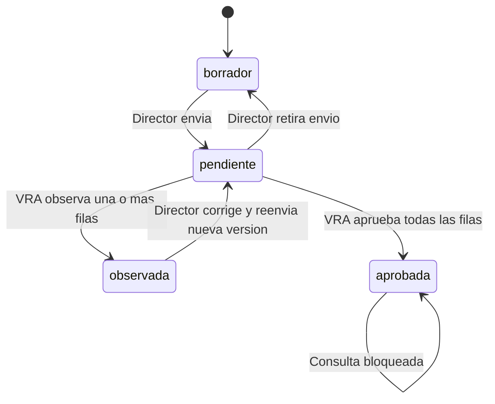
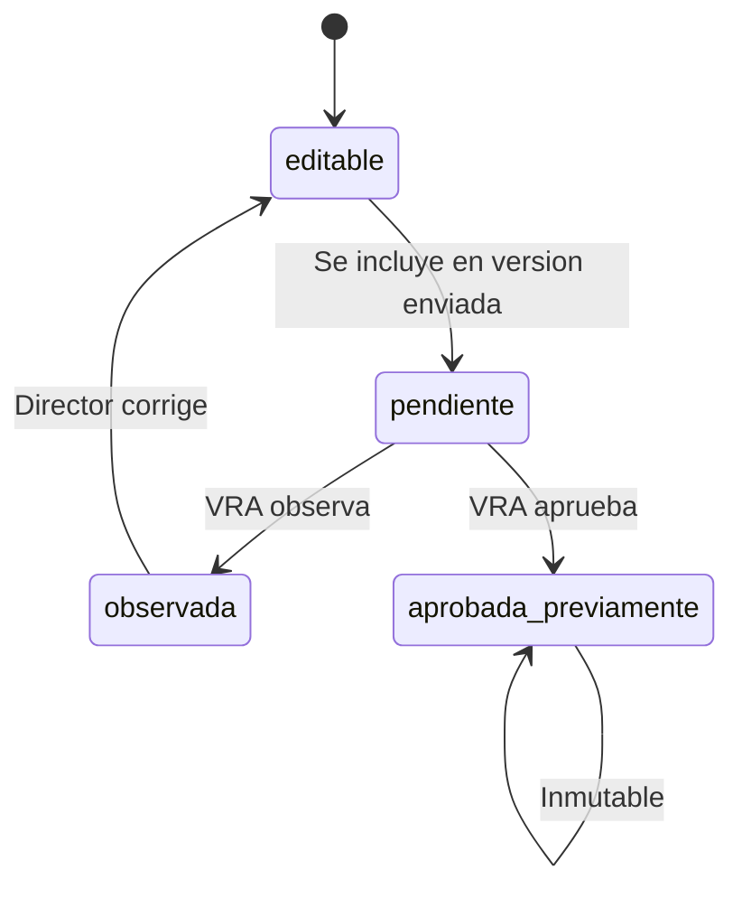

# Logica de negocio y flujo completo del boceto de Designaciones

## 1. Proposito y autoridad de este documento

Este documento describe de forma completa el comportamiento que representa
`public/boceto-designaciones`. Debe usarse como contexto funcional para
trasladar el flujo a un sistema real con persistencia, autenticacion,
autorizacion y auditoria.

El boceto es una maqueta funcional en memoria. Por lo tanto, sus reglas,
estados, validaciones y transiciones son la referencia del flujo de negocio,
pero sus estructuras JavaScript no sustituyen el modelo de datos real.

Cuando exista una diferencia entre este documento y una decision posterior de
negocio, debe actualizarse primero este documento y luego el boceto para que
ambos sigan siendo consistentes.

## 2. Alcance funcional

El flujo representa la preparacion, envio, revision, observacion, correccion,
reenvio y aprobacion de propuestas de designacion docente por carrera.

Tambien representa la distribucion manual de las horas de cada materia o
grupo entre:

- horas pagadas;
- horas no pagadas que forman parte de las horas oficiales;
- horas adicionales no pagadas que exceden las horas oficiales.

La materia continua siendo una sola designacion. No se crean dos filas para
separar pago y no pago.

El boceto no implementa:

- autenticacion real;
- permisos de backend;
- persistencia en base de datos;
- calculo monetario o presupuesto;
- concurrencia entre usuarios;
- archivos o reportes oficiales;
- integracion con nominas;
- bloqueo de seguridad contra manipulacion directa del navegador.

## 3. Roles y responsabilidades

### 3.1 Director de Carrera

El Director trabaja unicamente con las propuestas de su carrera simulada.
Puede:

1. consultar sus propuestas;
2. crear un borrador vacio;
3. crear un borrador inicializado desde una propuesta historica;
4. asignar materias y grupos a docentes elegibles;
5. definir la distribucion de horas pagadas y no pagadas;
6. registrar una justificacion opcional de la distribucion;
7. retirar un envio mientras esta pendiente;
8. corregir filas observadas;
9. reenviar una nueva version.

El Director no puede editar una propuesta que ya fue aprobada. Las filas
aprobadas previamente tampoco pueden modificarse desde el modal de
designacion.

### 3.2 Vicerrectorado Academico

Vicerrectorado trabaja desde la bandeja de revisiones. Puede:

1. consultar propuestas pendientes, observadas y aprobadas;
2. revisar cada materia o grupo enviado;
3. aprobar u observar cada fila;
4. registrar una observacion por fila;
5. registrar una observacion general;
6. aprobar toda la propuesta cuando todas las decisiones sean de aprobacion.

Vicerrectorado no edita:

- docente asignado;
- materia o grupo;
- horas oficiales;
- horas pagadas;
- horas no pagadas;
- justificacion de remuneracion.

La distribucion propuesta por el Director se conserva como parte de la
version revisada.

## 4. Arquitectura del boceto

El boceto esta compuesto por:

- `public/boceto-designaciones/index.html`: punto de entrada;
- `public/boceto-designaciones/styles.css`: estilos locales;
- `public/boceto-designaciones/app.js`: estado, reglas, renderizado, eventos y
  transiciones.

No hay API ni llamadas HTTP de negocio. `app.js` mantiene en memoria:

- usuarios simulados;
- propuestas;
- docentes;
- materias y catalogos;
- grupos por propuesta;
- notificaciones;
- snapshots de versiones.

Al recargar la pagina se reinicia todo el estado al conjunto de datos
simulado inicial.

## 5. Perfiles simulados y aislamiento visual

Los perfiles disponibles mediante el selector del avatar son:

| Perfil | Rol | Carrera |
|---|---|---|
| Mgtr. Maria Quispe | Director de Carrera | Ingenieria Informatica (INF) |
| Ing. Carlos Flores | Director de Carrera | Ingenieria Civil (CIV) |
| Dra. Ana Rojas | Director de Carrera | Medicina (MED) |
| Dr. Ricardo Villca | Vicerrectorado Academico | Todas las carreras |

Al cambiar a un Director, la vista inicial es `lista_director`. Al cambiar a
Vicerrectorado, la vista inicial es `bandeja_vicerrectorado`.

El aislamiento del boceto es visual y de estado en memoria. En el sistema
real debe imponerse tambien en consultas, politicas y endpoints.

## 6. Catalogo academico y unidad de asignacion

Cada materia del catalogo contiene como minimo:

```text
materiaId
materiaNombre
materiaSigla
codigo de grupo
horas oficiales
```

La unidad que se asigna es una fila materia/grupo. En el estado del boceto se
representa como un objeto con estos datos:

```text
id
materiaId
materiaNombre
materiaSigla
codigo
horas                  horas oficiales de la materia
docenteId              null si aun no esta asignada
estado                 editable, observada o aprobada_previamente
observacion            observacion academica de Vicerrectorado
horasPagadas           horas remuneradas
horasNoPagadas         horas no remuneradas
observacionRemuneracion justificacion opcional
```

Los objetos historicos que no tienen `horasPagadas` ni `horasNoPagadas` son
compatibles mediante valores por defecto:

```text
horasPagadas = horas oficiales
horasNoPagadas = 0
```

Cuando una designacion se guarda desde el modal, los nuevos campos se
materializan en la fila.

## 7. Estados de propuesta

Una propuesta puede estar en uno de estos estados:

| Estado | Significado | Puede editar Director | Puede revisar VRA |
|---|---|---:|---:|
| `borrador` | Propuesta en preparacion | Si | No |
| `pendiente` | Version enviada a Vicerrectorado | No | Si |
| `observada` | Devuelta con una o mas observaciones | Si | Consulta |
| `aprobada` | Aprobada y bloqueada | No | Consulta |

La propuesta tambien conserva:

- numero de version;
- carrera;
- gestion;
- periodo;
- solicitante;
- fecha de envio;
- observacion general.

## 8. Estados de una fila de designacion

| Estado | Uso |
|---|---|
| `editable` | Fila que puede ser modificada por el Director dentro de una propuesta editable. |
| `observada` | Fila que Vicerrectorado devolvio para correccion. |
| `aprobada_previamente` | Fila aprobada o congelada; no puede editarse desde el modal. |

Cuando Vicerrectorado aprueba una fila durante la revision, el boceto la
marca como `aprobada_previamente`. Cuando observa una fila, conserva
`observada` y la observacion de la fila.

Al corregir una fila observada mediante el modal, el boceto:

1. asigna el nuevo docente y distribucion;
2. cambia el estado de `observada` a `editable`;
3. elimina la observacion academica de esa fila.

La observacion general de la propuesta se conserva hasta que se reemplace
por una nueva decision.

## 9. Reglas de horas pagadas y no pagadas

### 9.1 Campos y formulas

Las horas oficiales se toman de `materias.horas`, representadas en el
boceto por `grupo.horas`.

```text
horas_totales = horas_pagadas + horas_no_pagadas
horas_adicionales_no_pagadas = max(0, horas_totales - horas_oficiales)
```

La materia sigue siendo una sola designacion aunque la distribucion tenga
componentes pagados y no pagados.

### 9.2 Distribuciones validas

Para una materia de 6 horas son validas, entre otras:

| Pagadas | No pagadas | Total | Adicionales no pagadas |
|---:|---:|---:|---:|
| 6 | 0 | 6 | 0 |
| 4 | 2 | 6 | 0 |
| 0 | 6 | 6 | 0 |
| 6 | 2 | 8 | 2 |
| 0 | 8 | 8 | 2 |

No existe un limite automatico para las horas adicionales no pagadas. La
decision de aceptar el exceso queda bajo responsabilidad de la revision de
Vicerrectorado.

### 9.3 Distribuciones invalidas

El guardado se rechaza si:

1. las horas pagadas no son un numero entero;
2. las horas no pagadas no son un numero entero;
3. cualquiera de las dos cantidades es negativa;
4. las horas pagadas superan las horas oficiales;
5. la suma de horas pagadas y no pagadas no cubre las horas oficiales.

Ejemplo invalido para una materia de 6 horas:

```text
5 horas pagadas + 0 horas no pagadas = 5
```

La distribucion no cubre las 6 horas oficiales y no se guarda.

La justificacion es opcional. Se muestra en el formulario y se hace visible
en la revision cuando fue registrada, especialmente si existen horas no
pagadas.

### 9.4 Compatibilidad de datos antiguos

Las designaciones antiguas que no tienen los campos nuevos se interpretan
como:

```text
horas_pagadas = horas oficiales
horas_no_pagadas = 0
observacion_remuneracion = null
```

En el sistema real esto debe resolverse con una migracion o con un valor por
defecto equivalente, sin perder snapshots anteriores.

## 10. Calculo de carga docente

Para cada docente se calcula la carga local de la propuesta con la suma de
`horas_totales` de sus filas asignadas:

```text
horas_pagadas_local = suma de horas pagadas de sus filas
horas_no_pagadas_local = suma de horas no pagadas de sus filas
horas_local = horas_pagadas_local + horas_no_pagadas_local
horas_total_global = horas_local + horasOtrasCarreras
```

Las horas de otras carreras se representan en el boceto por
`docente.horasOtrasCarreras`. El desglose pagado/no pagado de esas horas no
esta modelado en esta maqueta, pero su total si participa en la carga global.

La carga puede mostrarse con indicadores visuales para facilitar la lectura,
pero no existe un limite maximo ni minimo automatico de horas. En particular:

- una carga mayor a 32 horas no bloquea el envio;
- una carga menor a 6 horas no bloquea el envio;
- las horas adicionales no pagadas no tienen tope automatico;
- Vicerrectorado decide caso por caso durante la revision.

El calculo de carga es informativo y no debe bloquear el guardado, envio,
revision ni aprobacion por el solo hecho de superar o no alcanzar una
cantidad de horas.

El boceto actual aplica esta regla: la carga horaria es informativa y no
bloquea el guardado, envio, revision ni aprobacion por superar o no alcanzar
32 o 6 horas. La unica validacion de envio relacionada con la asignacion es
que todas las filas tengan docente.

Las horas no pagadas y las adicionales no pagadas cuentan exactamente igual
que las pagadas para esta carga.

## 11. Elegibilidad para asignar materias

En el modal de un docente:

1. una fila sin docente puede seleccionarse;
2. una fila ya asignada al mismo docente aparece seleccionada y puede editarse;
3. una fila asignada a otro docente aparece deshabilitada;
4. una fila `aprobada_previamente` aparece deshabilitada;
5. una fila asignada a otro docente no puede reasignarse desde el modal del
   docente actual;
6. al quitar la seleccion de una fila que pertenecia al docente actual, la
   fila queda sin docente y vuelve a `horas oficiales pagadas + 0 no pagadas`.

Esta regla evita que una materia ya asignada aparezca como opcion elegible
para otro docente dentro de la misma propuesta.

## 12. Flujo del Director

### 12.1 Lista de propuestas

`lista_director` muestra las propuestas de la carrera del usuario simulado,
con estado, version, cantidad de materias asignadas y acciones disponibles.

Pueden coexistir varias propuestas de la misma carrera, gestion y periodo.
Crear una propuesta vacia o copiar una propuesta historica siempre genera un
nuevo registro; las designaciones posteriores se guardan unicamente dentro de
la propuesta abierta.

Acciones principales:

- abrir propuesta;
- crear nueva propuesta;
- ver observaciones o decision final;
- abrir una propuesta aprobada en modo de consulta.

### 12.2 Crear borrador vacio

`crearBorradorVacio` crea una propuesta con:

- version 1;
- estado `borrador`;
- materias del catalogo de la carrera;
- todos los grupos sin docente;
- estado `editable`;
- distribucion por defecto.

Se registra un snapshot inicial en el historial en memoria.

### 12.3 Crear borrador para importar

`crearBorradorParaImportar` crea primero un borrador nuevo y luego abre la
vista de importacion. No modifica la propuesta historica de origen.

La lista de origen solo incluye propuestas de la misma carrera y excluye la
propuesta activa.

### 12.4 Asignar un docente

Desde el editor, el Director abre `Designar Materias` para un docente. El
modal muestra todas las filas de la propuesta, pero deshabilita las filas no
elegibles.

Para cada fila seleccionada se registran:

- horas pagadas;
- horas no pagadas;
- observacion de remuneracion opcional.

El resumen del modal muestra:

```text
total global = horas pagadas locales + horas no pagadas locales + horas de otras carreras
```

El guardado valida todas las filas seleccionadas antes de mutar el estado,
para evitar guardar parcialmente una asignacion si una fila es invalida.

### 12.5 Importar asignaciones historicas

La importacion busca coincidencias por `materiaSigla` y `codigo` de grupo.
Cuando encuentra una coincidencia en el borrador actual copia:

- docente;
- horas pagadas;
- horas no pagadas;
- observacion de remuneracion.

La fila destino queda `editable` y se limpian sus observaciones academicas de
revision. El estado historico de origen no se copia como bloqueo.

### 12.6 Enviar a Vicerrectorado

Antes de enviar, el boceto valida en este orden:

1. no debe existir una fila sin docente;
2. si la propuesta era `observada`, incrementa el numero de version;
3. cambia la propuesta a `pendiente`;
4. registra la fecha simulada de envio;
5. crea un snapshot de la version;
6. agrega una notificacion.

El snapshot conserva exactamente la distribucion de cada fila en el momento
del envio.

### 12.7 Retirar un envio

Mientras la propuesta esta `pendiente`, el Director puede retirarla. El
boceto la devuelve a `borrador` y limpia la fecha de envio. Las designaciones
permanecen en memoria para continuar editandolas.

### 12.8 Corregir y reenviar

Una propuesta `observada` vuelve a ser editable. El Director puede corregir
la asignacion, la distribucion o ambas. Al reenviar:

- se incrementa la version;
- se conserva la propuesta corregida;
- se genera un nuevo snapshot;
- la version anterior queda en el historial en memoria.

## 13. Flujo de Vicerrectorado

### 13.1 Bandeja

`bandeja_vicerrectorado` organiza las propuestas por:

- Inbox;
- pendientes;
- revisadas.

Tambien permite buscar por carrera, director o descripcion.

### 13.2 Revision de una version pendiente

`revisar_version` muestra el snapshot funcional de la propuesta pendiente y
las columnas:

- docente;
- materia;
- grupo;
- horas oficiales;
- horas pagadas;
- horas no pagadas;
- horas adicionales no pagadas;
- decision;
- observacion por fila.

Los campos de distribucion son solo lectura. Los unicos controles editables
son la decision y las observaciones de Vicerrectorado.

El checkbox global `Aprobar todas las filas` cambia visualmente las decisiones
de las filas editables. La decision final se aplica unicamente al confirmar
la revision.

### 13.3 Confirmar revision

`confirmarRevisionUnica` lee la decision de cada fila no aprobada previamente.

Si al menos una fila queda observada:

- la propuesta pasa a `observada`;
- se conserva la observacion general, si existe;
- se conservan las observaciones por fila;
- se notifica al Director;
- se registra un snapshot.

Si ninguna fila queda observada:

- la propuesta pasa a `aprobada`;
- las filas decididas como aprobadas pasan a `aprobada_previamente`;
- la propuesta se muestra bloqueada e inmutable;
- se registra la decision general;
- se notifica al Director;
- se registra un snapshot.

### 13.4 Consulta de versiones cerradas

Una propuesta aprobada u observada fuera de una revision pendiente se muestra
en modo de consulta. El desglose de horas sigue visible, pero no se muestran
controles para editarlo.

## 14. Versionado y snapshots

El historial en memoria se mantiene en `historialVersionesPorPropuesta`.
Cada snapshot contiene:

```text
numeroVersion
estado
solicitadoEn
observacionGeneral
registradoEn
grupos completos, incluyendo horas pagadas y no pagadas
```

`clonarGruposPropuesta` usa una copia profunda JSON. Por eso la distribucion
queda congelada dentro del snapshot aunque el borrador posterior cambie.

Los snapshots se registran para conservar el estado de cada version, pero el
boceto actual no incluye un visor de historial visible para el usuario. La
consulta visible se limita a la version, estado y observaciones de la
propuesta activa.

En el sistema real se requiere:

1. una tabla de versiones;
2. una tabla de snapshots de designaciones;
3. restricciones para impedir edicion de versiones aprobadas;
4. auditoria de cada envio, observacion, correccion y aprobacion;
5. lectura de la version enviada, no del borrador mutable, durante la revision.

## 15. Notificaciones

El boceto agrega notificaciones en memoria para:

- envio de una propuesta a revision;
- devolucion con observaciones;
- aprobacion oficial.

La bandeja de notificaciones es simulada. En el sistema real cada evento debe
crear una notificacion dirigida al usuario correspondiente y una URL segura
que abra la propuesta o revision autorizada.

## 16. Maquina de estados



Flujo de una fila:



## 17. Casos de aceptacion funcional

### Distribucion

- [x] Materia de 6 horas con `6 + 0` se guarda.
- [x] Materia de 6 horas con `4 + 2` se guarda.
- [x] Materia de 6 horas con `0 + 6` se guarda.
- [x] Materia de 6 horas con `6 + 2` se guarda y muestra 2 adicionales.
- [x] `5 + 0` para una materia de 6 horas se rechaza.
- [x] Horas negativas se rechazan.
- [x] Decimales se rechazan.
- [x] Horas pagadas mayores a las oficiales se rechazan.
- [x] La justificacion puede omitirse.
- [x] Las horas no pagadas aparecen en la carga total.

### Asignacion

- [ ] Una materia asignada a otro docente no aparece como seleccionable.
- [ ] Una materia aprobada previamente no se puede editar.
- [ ] Quitar una materia devuelve la fila a sin docente y reinicia su distribucion.
- [x] Importar copia tambien la distribucion de remuneracion.

### Revision y versionado

- [x] Vicerrectorado ve las cuatro columnas de horas.
- [x] Vicerrectorado no puede editar las horas.
- [ ] Observar una fila devuelve la propuesta al Director.
- [ ] Corregir una fila observada la vuelve editable.
- [ ] Reenviar incrementa la version.
- [x] Aprobar congela propuesta, filas y distribucion.
- [x] Los snapshots conservan los valores exactos de cada version.

## 18. Requisitos para el sistema real

El sistema real conserva el mismo comportamiento visible y lleva las reglas al
servidor:

### Designacion editable

```text
horas_pagadas integer not null default 0
horas_no_pagadas integer not null default 0
observacion_remuneracion text nullable
```

Las restricciones deben garantizar:

```text
horas_pagadas >= 0
horas_no_pagadas >= 0
horas_pagadas <= materias.horas
horas_pagadas + horas_no_pagadas >= materias.horas
```

### Snapshot

La tabla de snapshot debe almacenar ambos valores, no solo las horas
oficiales. Una version aprobada debe ser inmutable y una correccion debe crear
una nueva version.

### Autorizacion

- el Director solo modifica propuestas de su carrera y en estado editable;
- Vicerrectorado decide una version pendiente;
- Vicerrectorado no modifica la distribucion propuesta;
- las materias ya asignadas quedan excluidas por consulta y por validacion de
  servidor;
- una propuesta aprobada no acepta mutaciones.

### Auditoria

Los eventos deben registrar actor, fecha, version, fila afectada, decision,
horas pagadas, horas no pagadas y observaciones cuando correspondan.

## 19. Mapa de implementacion del boceto

| Responsabilidad | Funcion o zona de `app.js` |
|---|---|
| Cambiar perfil simulado | `switchUser` |
| Cambiar vista | `switchView`, `renderMainView` |
| Compatibilidad de horas antiguas | `getHorasPagadasGrupo`, `getHorasNoPagadasGrupo` |
| Calcular totales | `getHorasTotalesGrupo`, `getHorasAdicionalesNoPagadasGrupo` |
| Validar distribucion | `validarDistribucionHoras` |
| Editor del Director | `renderEditorCarreraView` |
| Importacion | `previsualizarImportacion`, `aplicarImportacion` |
| Bandeja VRA | `renderBandejaVicerrectoradoView` |
| Revision VRA | `renderRevisarVersionView` |
| Confirmar decision | `confirmarRevisionUnica` |
| Crear borradores | `crearBorradorBase` |
| Enviar y versionar | `enviarPropuestaVicerrectorado` |
| Modal de designacion | `abrirModalAsignarDocente`, `guardarAsignacionDocente` |
| Totales del modal | `toggleModalGrupo`, `recalcularModalHoras` |
| Snapshots | `clonarGruposPropuesta`, `registrarSnapshotVersion` |

## 20. Limites conocidos del boceto

1. El estado se pierde al recargar.
2. Las fechas y algunos datos son simulados.
3. Las horas de otras carreras son un total sin desglose de remuneracion.
4. La seguridad de roles es solo visual.
5. La inmutabilidad es una regla de interfaz, no una restriccion de base de
   datos.
6. Los mensajes `alert` y `confirm` representan validaciones y decisiones
   que en el sistema real deben convertirse en componentes de interfaz y
   respuestas de servidor.
7. El catalogo de materias y docentes es fijo para la demostracion.
8. Los snapshots se almacenan en memoria, pero no existe una pantalla para
   navegar el historial completo de versiones.
