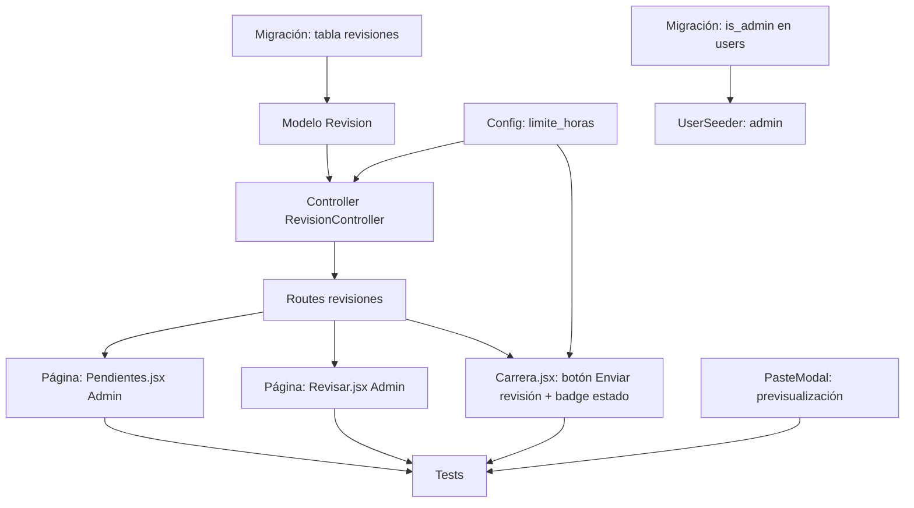

# Plan maestro — DesignacionesUATF

## Arquitectura general

### 1. Revisión por carrera (flujo de aprobación)

**Problema**: Usuario normal solo crea propuestas. Admin debe revisar y aprobar/rechazar en lote por carrera.

**Solución**: Tabla `revisiones` que trackea ciclo de revisión por carrera+gestion+periodo.

**Flujo completo**:
1. Usuario normal modifica designaciones en carrera (estado = `propuesta`)
2. Usuario hace clic "Enviar a revisión" → se crea `revision` con estado `pendiente`
3. Admin ve lista de carreras pendientes en `/revisiones/pendientes`
4. Admin entra a revisar una carrera, ve tabla con todas las designaciones
5. Admin puede aprobar/rechazar individual o en lote
6. Admin hace clic "Completar revisión" → revision pasa a `revisado`, se guarda timestamp + quién revisó
7. Las designaciones aprobadas quedan `aprobada`, las rechazadas `rechazada`

### 2. Límite de horas configurable

**Problema**: `CargaAcademicaService::LIMITE_HORAS = 6` está hardcodeado.

**Solución**: Archivo `config/designaciones.php` que lee de `.env`. El servicio usa `config('designaciones.limite_horas', 6)`.

### 3. PasteModal previsualización

**Problema**: Al pegar, usuario no sabía qué filas serán saltadas.

**Solución**: Nuevo endpoint `POST /designaciones/previsualizar-pegado` que hace mismas validaciones que `pegar()` pero solo retorna resultados, sin crear nada. PasteModal lo llama antes de mostrar la tabla para marcar filas OK/saltadas.

---

## Dependencias entre tareas



---

## Desglose de tareas

### T1 — Migración `add_is_admin_to_users_table`
**Archivos**: `database/migrations/2026_07_17_000001_add_is_admin_to_users_table.php`

**Qué hacer**:
- Columna `is_admin` boolean, default `false`, después de `password`
- `php artisan migrate` para probar
- `php artisan migrate:rollback` para deshacer si hay error

**Verificación**: `php artisan migrate` exitoso, columna aparece en estructura.

---

### T2 — Migración `create_revisiones_table`
**Archivos**: `database/migrations/2026_07_17_000002_create_revisiones_table.php`

**Columnas**:
| Columna | Tipo | Detalles |
|---------|------|----------|
| id | bigIncrements | PK |
| carrera_id | foreignId | FK → carreras.id, cascadeOnDelete |
| Id_gestion | unsignedBigInteger | FK → gestiones.id |
| Id_periodo | unsignedBigInteger | FK → periodos.id |
| solicitado_por | foreignId | FK → users.id |
| solicitado_en | timestamp | nullable |
| revisado_por | foreignId | FK → users.id, nullable |
| revisado_en | timestamp | nullable |
| estado | string(20) | default 'pendiente' |
| created_at | timestamp | |
| updated_at | timestamp | |
| unique | ['carrera_id', 'Id_gestion', 'Id_periodo', 'estado'] | Solo una pendiente activa |

**Foreign keys**: carrera_id, Id_gestion, Id_periodo, solicitado_por, revisado_por

**Verificación**: `php artisan migrate` exitoso.

---

### T3 — Modelo `Revision`
**Archivos**: `app/Models/Revision.php`

```php
class Revision extends Model
{
    protected $table = 'revisiones';
    protected $fillable = ['carrera_id', 'Id_gestion', 'Id_periodo', 'solicitado_por', 'solicitado_en', 'revisado_por', 'revisado_en', 'estado'];
    protected $casts = [
        'solicitado_en' => 'datetime',
        'revisado_en' => 'datetime',
    ];

    public function carrera(): BelongsTo { return $this->belongsTo(Carrera::class); }
    public function solicitante(): BelongsTo { return $this->belongsTo(User::class, 'solicitado_por'); }
    public function revisor(): BelongsTo { return $this->belongsTo(User::class, 'revisado_por'); }
}
```

**Verificación**: Cargar modelo en tinker o test.

---

### T4 — Config `limite_horas` y actualizar `CargaAcademicaService`
**Archivos**:
- `config/designaciones.php` (nuevo)
- `app/Support/CargaAcademicaService.php` (modificar)
- `.env` (agregar `DESIGNACIONES_LIMITE_HORAS=6`)

**config/designaciones.php**:
```php
<?php
return [
    'limite_horas' => (int) env('DESIGNACIONES_LIMITE_HORAS', 6),
];
```

**CargaAcademicaService.php**:
- Cambiar `public const LIMITE_HORAS = 6;` a que use config
- Mejor mantener constante pero que lea de config: `public const LIMITE_HORAS = 6;` y agregar método estático `public static function getLimite(): int { return config('designaciones.limite_horas', self::LIMITE_HORAS); }`
- Cambiar todas las referencias de `CargaAcademicaService::LIMITE_HORAS` a `CargaAcademicaService::getLimite()`

**Archivos que referencian `LIMITE_HORAS`**: Buscar con grep.

**Verificación**: Tests pasan, configuración se lee de .env.

---

### T5 — Controller `RevisionController`
**Archivos**: `app/Http/Controllers/RevisionController.php`

**Métodos**:

1. **`solicitar(Request)`** — POST, crea revision si no hay una pendiente activa para esa carrera+gestion+periodo
   - Validación: `carrera_id`, `Id_gestion`, `Id_periodo`
   - Si ya existe revision pendiente, retornar error "Ya hay una revisión pendiente para esta carrera"
   - Crear revision con `solicitado_en = now()`, `estado = 'pendiente'`
   - Retornar JSON `{ success: true, revision_id: ... }` o redirect

2. **`pendientes()`** — GET, lista carreras con revisiones pendientes (solo admin)
   - Cargar revisiones con estado `pendiente`, con relación `carrera`, `solicitante`
   - Agrupar por carrera para mostrar una fila por carrera
   - Retornar Inertia: `Revisiones/Pendientes`

3. **`revisar(Revision)`** — GET, tabla con todas las designaciones de esa carrera+gestion+periodo
   - Cargar designaciones con docente, materia, grupo
   - Retornar Inertia: `Revisiones/Revisar`

4. **`procesar(Revision, Request)`** — POST, procesa batch de aprobar/rechazar
   - Validación: `acciones` array de `{id: designacion_id, accion: "aprobar"|"rechazar"}`
   - En transacción actualizar estado de cada designación
   - Si se aprueba: `estado = 'aprobada'`, `aprobado_por = auth()->id()`
   - Si se rechaza: `estado = 'rechazada'`
   - Retornar JSON `{ procesadas: N }`

5. **`completar(Revision)`** — POST, marca revision como revisada
   - Actualizar: `estado = 'revisado'`, `revisado_por = auth()->id()`, `revisado_en = now()`
   - Retornar JSON `{ success: true }`

**Middleware**: Los métodos `pendientes`, `revisar`, `procesar`, `completar` deben verificar que el usuario es admin. Agregar método privado o middleware inline: `if (! $request->user()->is_admin) abort(403);`

---

### T6 — Rutas de revisiones
**Archivos**: `routes/web.php` (modificar)

Agregar dentro del grupo `auth`:

```php
Route::post('revisiones/solicitar', [RevisionController::class, 'solicitar'])->name('revisiones.solicitar');
Route::get('revisiones/pendientes', [RevisionController::class, 'pendientes'])->name('revisiones.pendientes');
Route::get('revisiones/{revision}/revisar', [RevisionController::class, 'revisar'])->name('revisiones.revisar');
Route::post('revisiones/{revision}/procesar', [RevisionController::class, 'procesar'])->name('revisiones.procesar');
Route::post('revisiones/{revision}/completar', [RevisionController::class, 'completar'])->name('revisiones.completar');
```

**Verificación**: `php artisan route:list | grep revisiones` muestra las 5 rutas.

---

### T7 — Página `Revisiones/Pendientes.jsx`
**Archivos**: `resources/js/Pages/Revisiones/Pendientes.jsx` (nuevo)

**Funcionalidad**:
- Tabla con carreras pendientes de revisión
- Columnas: Carrera (nombre+sigla), Gestión/Periodo, Solicitante, Solicitado el, Acciones (botón "Revisar" → link a route revisiones.revisar)
- Si no hay pendientes, mostrar EmptyState
- Usar AppLayout
- Solo accesible por admin (validar en backend ya)

---

### T8 — Página `Revisiones/Revisar.jsx`
**Archivos**: `resources/js/Pages/Revisiones/Revisar.jsx` (nuevo)

**Funcionalidad**:
- Breadcrumb: Revisiones pendientes > Carrera X
- Info bar: Carrera, Gestión/Periodo, Solicitado por, Estado
- Tabla con todas las designaciones de esa carrera+gestion+periodo
- Columnas: Checkbox, Docente, Materia, Grupo, Estado actual, Acción
- En columna "Acción": botones "Aprobar" (verde) y "Rechazar" (rojo) por fila
- Botón "Aprobar seleccionadas" y "Rechazar seleccionadas" en toolbar
- Botón "Completar revisión" (solo visible si hay al menos una designación procesada)
- Al completar, redirigir a revisiones.pendientes
- Estados: mostrar badge con color (verde=aprobada, rojo=rechazada, ambar=propuesta)

---

### T9 — Carrera.jsx: botón "Enviar a revisión" + badge estado
**Archivos**: `resources/js/Pages/Designaciones/Carrera.jsx` (modificar)

**Cambios**:
- Recibir nueva prop `revision` (objeto con estado de revisión actual o null)
- En la info bar (junto a los badges de estado), agregar sección de estado de revisión:
  - Si no hay revision pendiente: badge gris "Sin enviar a revisión" + botón "Enviar a revisión"
  - Si hay revision pendiente: badge ambar "En revisión" (deshabilitar botón, mostrar "Enviado el fecha")
  - Si la última revision está revisada: badge verde "Revisado" + info de quién y cuándo + botón para enviar de nuevo
- Botón "Enviar a revisión" hace POST a route revisiones.solicitar con carrera_id, gestion_id, periodo_id
- Al éxito, recargar página con router.reload

**IMPORTANTE**: La prop `revision` la debe enviar el `DesignacionController::carrera()` — buscar la última revision para esa carrera+gestion+periodo y pasarla a la vista.

---

### T10 — PasteModal: previsualización de filas a saltar
**Archivos**:
- `app/Http/Controllers/DesignacionMasivaController.php` (modificar - agregar método previsualizar)
- `resources/js/Components/PasteModal.jsx` (modificar)

**Backend** — nuevo método `previsualizar(Request)`:
- Misma validación que `pegar()` pero sin crear nada
- Retorna JSON con array de filas, cada una con: `{ id, Id_docente, Id_materia, Id_grupo, materia_sigla, materia_nombre, docente_nombre, grupo_codigo, estado: "ok"|"grupo_ocupado"|"excede_horas"|"sin_docente" }`
- Reutilizar lógica de validación del método pegar

**Frontend — PasteModal.jsx**:
- Al abrirse, llamar a `previsualizar` endpoint con las filas del clipboard + destino gestion/periodo
- Mostrar columna extra "Estado" con icono:
  - ✅ Listo (verde) para filas OK
  - ⚠️ Grupo ocupado (ambar) para saltadas
  - ⚠️ Excede horas (ambar) para saltadas
  - ❌ Sin docente (rojo) para inválidas
- Deshabilitar checkbox de filas que serán saltadas
- En barra inferior mostrar "N de M filas se pegarán, X se omitirán"

---

### T11 — UserSeeder: admin
**Archivos**: `database/seeders/UserSeeder.php` (modificar)

- Agregar admin user: `['name' => 'Admin', 'email' => 'admin@uatf.edu.bo', 'password' => Hash::make('admin'), 'is_admin' => true]`
- Poner `is_admin` en `firstOrCreate` (el unique es por email, se actualizará)

---

### T12 — Tests
**Archivos**: (nuevos tests)

- `tests/Feature/RevisionTest.php`:
  - test_usuario_envia_revision_con_exito
  - test_no_permite_dos_revisiones_pendientes_misma_carrera
  - test_admin_aprueba_designaciones_en_lote
  - test_admin_rechaza_designaciones_en_lote
  - test_admin_completa_revision
  - test_usuario_normal_no_ve_revisiones_pendientes
  - test_admin_puede_ver_pendientes

**Patrón a seguir** (de tests existentes):
- Usar `DatabaseTransactions` (no RefreshDatabase)
- Factory chaining: create carreras, materias, grupos, docentes, designaciones de prueba
- `$this->actingAs($user)` para autenticar
- Crear users con `User::factory()->create(['is_admin' => true/false])`

---

## Checklist final

- [x] T1: migración is_admin ✔️
- [x] T2: migración revisiones ✔️
- [x] T3: modelo Revision ✔️
- [x] T4: config limite_horas ✔️
- [x] T5: RevisionController con 5 métodos ✔️
- [x] T6: rutas agregadas ✔️
- [x] T7: Pendientes.jsx página ✔️
- [x] T8: Revisar.jsx página ✔️
- [x] T9: Carrera.jsx con botón enviar/revisión ✔️
- [x] T10: PasteModal previsualización ✔️
- [x] T11: UserSeeder con admin ✔️
- [x] T12: Tests pasando ✔️
- [x] `npm run build` exitoso ✔️
- [x] Bitácora actualizada ✔️
